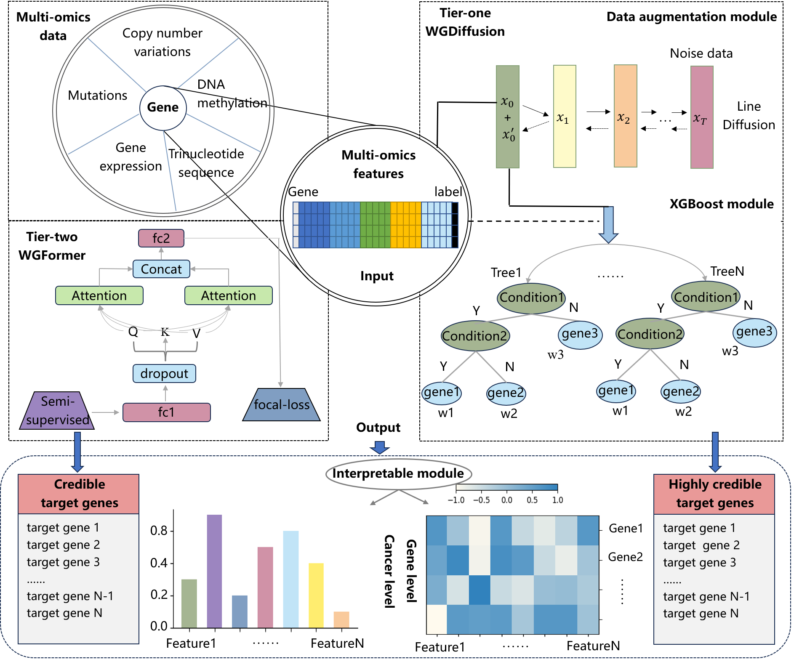

# WGMap

WGMap offers a machine-learning approach for researchers and clinicians to delve into the whole druggable genome of cancer and identify promising targets for anti-cancer therapies. By integrating multi-omics data from large tumor cohorts, including The Cancer Genome Atlas (TCGA) and Pan-Cancer Analysis of Whole Genomes (PCAWG), WGMap provides a comprehensive and robust approach for anti-cancer target gene discovery across the whole genome.

# Key Features and Capabilities
1. Multi-Omics Data Integration: WGMap analyzes various data types, including somatic mutations, copy number variations, gene expression, and DNA methylation, to gain a holistic understanding of the genomic landscape of cancer.
2. Pan-Cancer and Cancer-Specific Targets: The framework identifies both pan-cancer targets, with potential applicability across various cancer types, and cancer-specific targets, tailored to individual cancer types.
3. Coding and Non-Coding Genes: WGMap goes beyond the analysis of protein-coding genes and explores the vast potential of non-coding genes as anti-cancer targets.
4. Extensive Target Landscape: The framework unveils a diverse set of potential targets, including 225 coding genes and an impressive 1,752 non-coding genes with pan-cancer potential, along with additional cancer-specific targets.

# Running WGMap

Disclaimer: The provided instructions assume you have the necessary computational resources and software dependencies installed. Please refer to the original paper and requirements.txt for detailed instructions and troubleshooting.

# Coding Region Analysis
To run efficiently, we do not retrain the neural network. If you need to download the original data and retrain the neural network, change the -m predict parameter from the command line to train.

Cross validation performance and predicted anti-cancer target genes of coding pan-cancer analysis on tier1 dataset:

``cd /code/CodingCode/pancan_tier1/code/``

``python dm_xgb_pancan_train.py -m predict``

``python dm_xgb_pancan_predict.py -m predict``

Cross validation performance and predicted anti-cancer target genes of coding pan-cancer analysis on tier2 dataset:

``cd /code/CodingCode/pancan_tier2/code/``

``python semi_trans_pancan_train.py  -m predict``

``python semi_trans_pancan_predict.py  -m predict``  

Cross validation performance and predicted anti-cancer target genes of coding specific-type-cancer analysis on tier1 datasets:

``cd /code/CodingCode/ecancer_tier1/code/``

``python dm_xgb_ecancer_train.py -m predict -t prad``

``python dm_xgb_ecancer_predict.py -m predict -t prad`` 

Cross validation performance and predicted anti-cancer target genes of coding specific-type-cancer analysis on tier2 datasets:

``cd /code/CodingCode/ecancer_tier2/code/``

``python semi_trans_ecancer_train.py -m predict -t prad``

``python semi_trans_ecancer_predict.py -m predict -t prad``

We provide the coding omic features of mutation, CNV, and gene expression.As the file is too large to upload, please refer to the paper data website to download the original dataset:

``cd /extract_fea/coding``

``mkdir /root/capsule/results/coding_fea/``

``python extract.py -t mut``

``python extract.py -t cnv``

``python extract.py -t exp``

# Non-Coding Region Analysis
Cross validation performance and predicted anti-cancer target genes of non-coding pan-cancer analysis on tier1 dataset:

``cd /code/Non-codingCode/pancan_tier1/code``

``python WGDiffusion_train.py -m train``

``python WGDiffusion_predict.py -m pred``

Cross validation performance and predicted anti-cancer target genes of non-coding pan-cancer analysis on tier2 dataset:

``cd /code/Non-codingCode/pancan_tier2/code``

``python WGFormer_train.py -m train``

``python WGFormer_predict.py -m pred``

Cross validation performance and predicted anti-cancer target genes of non-coding specific-type-cancer analysis on tier1 datasets:

``cd /code/Non-codingCode/ecancer_tier1/code``

``python WGDiffusion_train.py -m train -t 'OV'``

``python WGDiffusion_predict.py -m pred -t 'OV'``

Cross validation performance and predicted anti-cancer target genes of non-coding specific-type-cancer analysis on tier2 datasets:

``cd /code/Non-codingCode/ecancer_tier2/code``

``python WGFormer_train.py -m train -t 'STAD'``

``python WGFormer_predict.py -m pred -t 'LIHC'``

We provide the non-coding omic features of mutation, CNV, and gene expression.As the file is too large to upload, please refer to the paper data website to download the original dataset:

``cd /extract_fea/non-coding``

``python extract_fea.py -m mut -t Pancan``

``python extract_fea.py -m cna -t Pancan``

``python extract_fea.py -m rna -t Pancan``

